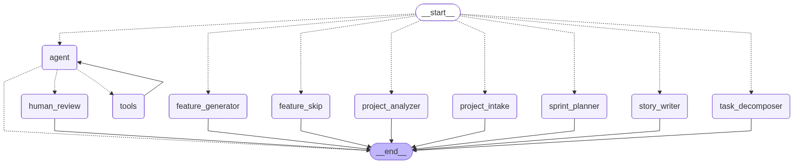

# Scrum AI Agent

A terminal-based AI agent that takes a project and scrums it down — decomposing scope into epics, user stories, tasks, and sprint plans — interactively from the command line.

---

## Getting Started

### Prerequisites

- Python 3.11+
- An [Anthropic API key](https://console.anthropic.com/settings/keys)

### Installation

```bash
make install        # installs uv, creates venv, installs dependencies
make env            # creates .env from .env.example
make pre-commit     # installs pre-commit hooks
```

Then open `.env` and add your API keys:

#### Anthropic (required)

The agent uses Claude as its LLM. Get an API key from the [Anthropic Console](https://console.anthropic.com/settings/keys).

```
ANTHROPIC_API_KEY=sk-ant-...
```

#### LangSmith (optional)

[LangSmith](https://smith.langchain.com/) provides tracing and observability for LangChain/LangGraph applications. Useful during development to inspect agent runs.

1. Create a free account at [smith.langchain.com](https://smith.langchain.com/)
2. Go to **Settings > API Keys** and create a key
3. Add to your `.env`:

```
LANGSMITH_TRACING=true
LANGSMITH_API_KEY=lsv2_pt_...
LANGSMITH_PROJECT=scrum-agent
```

If these are not set, the agent runs normally without tracing.

### Usage

```bash
make run            # run the CLI
make test           # run tests
make lint           # lint with ruff
make format         # format with ruff
```

---

## Table of Contents

- [Getting Started](#getting-started)
- [Overview](#overview)
- [Agent Classification](#agent-classification)
- [Architecture](#architecture)
- [Project Intake Questionnaire](#project-intake-questionnaire)
- [Scrum Standards](#scrum-standards)
  - [Issue Hierarchy](#1-issue-hierarchy)
  - [User Stories](#2-user-stories)
  - [Acceptance Criteria](#3-acceptance-criteria)
  - [Definition of Done — User Story](#4-definition-of-done--user-story)
  - [Definition of Done — Spike](#5-definition-of-done--spike)
  - [Sprint Ceremonies](#6-sprint-ceremonies)
  - [Backlog Health](#7-backlog-health)
  - [Story Splitting Guidelines](#8-story-splitting-guidelines)
- [Tools](#tools)
- [Prompt Construction](#prompt-construction)
- [Memory & State](#memory--state)
- [Guardrails](#guardrails)
- [RAG Integration](#rag-integration)
- [User Experience](#user-experience)
- [Tech Stack](#tech-stack)
- [Build Order](#build-order)
- [Evaluation & Testing](#evaluation--testing)
- [Agentic Blueprint Reference](#agentic-blueprint-reference)

---

## Overview

The Scrum AI Agent is a CLI tool that acts as a senior Scrum Master. You describe your project, it interviews you to understand scope, team, constraints, and risks, then generates a full Scrum plan: epics, user stories with acceptance criteria, story point estimates, sprint allocations, and optionally pushes everything to Jira.

The agent is built on two foundations:

1. **The Agentic Blueprint** — architecture, reasoning patterns, tools, memory, guardrails, and production practices for building LLM-powered agents with LangGraph
2. **Scrum Standards** — the team's codified practices for writing stories, acceptance criteria, Definitions of Done, and managing backlogs

Both are consolidated into this document.

---

## Agent Classification

| Property | Value |
|----------|-------|
| **Agency Level** | Level 3–4 (self-looping + multi-agent coordination) |
| **Reasoning Pattern** | ReAct (Thought → Action → Observation → repeat) |
| **Interface** | Terminal CLI (rich interactive REPL) |
| **Domain** | Scrum project management |

The agent autonomously reasons about project scope, makes decisions about decomposition, and re-plans when the user provides feedback — satisfying all three criteria for agentic behavior: tool use, multi-step branching logic, and autonomous next-step decisions.

---

## Architecture

### Four Layers

| Layer | Implementation |
|-------|---------------|
| **Interface** | Rich terminal CLI with streaming output, confirmation prompts, selection menus, and markdown rendering |
| **Prompt Construction** | Scrum Master persona, few-shot examples of quality user stories, ARC-structured prompts per node |
| **Model** | Anthropic Claude (primary), swappable to OpenAI or others via LangChain abstraction |
| **Data & Storage** | Session memory (MemorySaver → SQLite), optional vector store (Chroma) for codebase RAG |

### Three Design Principles

1. **Robust Infrastructure** — scalable compute, reliable deployment pipelines with rollback capability, agent frameworks (LangChain, LangGraph)
2. **Modularity** — decoupled UI/agent logic/data stores, one agent per domain, avoid the God Agent anti-pattern
3. **Continuous Evaluation** — quantitative metrics (success rate, latency, cost per interaction) + qualitative feedback, deploy-measure-improve loop

### Agent Graph (LangGraph)

**Current graph topology** (auto-generated via `make graph`):



**Target architecture (future state):**

```
START → project_intake → [questionnaire loop] → project_analyzer → epic_generator → [human review]
                                                                                          │
                                                                      ┌────────────────────┘
                                                                      ▼
                                                                story_writer → [human review]
                                                                      │
                                                                      ▼
                                                              task_decomposer → [human review]
                                                                      │
                                                                      ▼
                                                              sprint_planner → [human review]
                                                                      │
                                                                      ▼
                                                                jira_sync → END
```

The graph begins with a **Project Intake Questionnaire** — a structured discovery phase where the agent asks the user a series of questions one-by-one to fully understand the project before generating any Scrum artifacts. Each subsequent node feeds into a human-in-the-loop checkpoint. The user can accept, edit, or reject output at every stage. On rejection, the agent re-enters the ReAct loop with the user's feedback.

### The ReAct Loop

The foundational reasoning pattern:

```
Thought → Action → Observation → (repeat until done)
```

1. **Thought** — reason about the current state and what to do next
2. **Action** — call a tool or take a step
3. **Observation** — see the result, decide whether to continue or answer

### Node Descriptions

| Node | Responsibility |
|------|---------------|
| **Project Intake** | Runs the discovery questionnaire to gather all project context before any decomposition begins |
| **Project Analyzer** | Ingests the questionnaire answers + any provided description/codebase and extracts scope, goals, and constraints |
| **Epic Generator** | Decomposes the analyzed scope into high-level epics |
| **Story Writer** | Breaks each epic into user stories with acceptance criteria and story point estimates |
| **Task Decomposer** | Breaks stories into concrete technical tasks |
| **Sprint Planner** | Allocates stories to sprints based on velocity and capacity |
| **Jira Sync** | Pushes the finalized plan to Jira (epics, stories, sprints) |

### Multi-Agent Patterns

| Pattern | How It Works | Best For |
|---------|-------------|----------|
| **Manager** | Central agent delegates to specialists, synthesises results | Consistent UX, controlled output |
| **Decentralized** | Triage agent hands off, specialist owns conversation | Deep domain expertise |
| **Supervisor** | Hierarchical delegation, workers return results | Research/writing pipelines |

---

## Project Intake Questionnaire

Before generating any Scrum artifacts, the agent runs a structured discovery phase — asking the user questions **one at a time** in a conversational flow. This is the "flipped prompt" technique: the agent gathers what it needs before it acts.

### Questionnaire Flow

The agent asks these questions sequentially. Each question is asked individually, the user responds, and the agent moves to the next. The agent adapts follow-up questions based on previous answers.

#### Phase 1 — Project Context

| # | Question | Why the Agent Needs This |
|---|----------|-------------------------|
| 1 | **What is the project?** Describe it in a few sentences, or point me to a repo/doc. | Establishes the core scope and domain |
| 2 | **Is this a greenfield project or are you building on an existing codebase?** | Determines whether the agent should scan existing code, and whether there's legacy complexity |
| 3 | **What problem does this project solve? Who are the end users?** | Grounds epic/story generation in real user needs rather than abstract features |
| 4 | **What does "done" look like? What's the end-state you're targeting?** | Defines the finish line — prevents scope creep and gives the agent a clear goal to decompose toward |
| 5 | **Are there any hard deadlines or milestones?** | Constrains the sprint plan; the agent needs to know if time is fixed |

#### Phase 2 — Team & Capacity

| # | Question | Why the Agent Needs This |
|---|----------|-------------------------|
| 6 | **How many engineers are working on this?** | Directly affects sprint capacity and parallelism of work |
| 7 | **What are the roles on the team?** (e.g., 2 backend, 1 frontend, 1 fullstack) | Lets the agent tag stories by discipline and balance sprint workload across skillsets |
| 8 | **How long are your sprints?** (e.g., 1 week, 2 weeks) | Required for sprint planning — determines how many points fit per sprint |
| 9 | **Do you have a known velocity from previous sprints?** If yes, what is it? | If available, the agent uses real velocity; otherwise it defaults to **5 points per engineer per sprint** |
| 10 | **How many sprints are you targeting to complete this project?** | Bounds the total effort and forces prioritization if scope exceeds capacity |

#### Phase 3 — Technical Context

| # | Question | Why the Agent Needs This |
|---|----------|-------------------------|
| 11 | **What is the tech stack?** (languages, frameworks, databases, infra) | Stories and tasks need to be written in terms the team actually works with |
| 12 | **Are there any existing APIs, services, or third-party integrations involved?** | Identifies external dependencies that create stories of their own (auth, payments, etc.) |
| 13 | **Are there any architectural constraints or decisions already made?** (e.g., must use microservices, must deploy to AWS) | Prevents the agent from suggesting work that contradicts fixed decisions |
| 14 | **Is there any existing documentation, PRDs, or design docs I should reference?** | The agent can ingest these for RAG-grounded story generation |

#### Phase 3a — Codebase Context

| # | Question | Why the Agent Needs This |
|---|----------|-------------------------|
| 15 | **Does the project have an existing codebase, or is this a new build?** | Determines whether the agent needs to account for existing code, migrations, and legacy constraints vs. starting from scratch |
| 16 | **Where is the code hosted?** (GitHub, Azure DevOps, GitLab, Bitbucket, local only) | Tells the agent which source control tool to use for repo scanning |
| 17 | **Can you share the repo URL(s)?** (the agent can connect and scan the repo for context) | Enables the agent to read repo structure, key files, and README to ground its output in the actual codebase |
| 18 | **How is the repo structured?** (monorepo, multi-repo, microservices, monolith) | Affects how the agent decomposes work — a monorepo may need cross-cutting stories, microservices need per-service epics |
| 19 | **Is there an existing CI/CD pipeline or deployment setup?** | Identifies whether DevOps stories are needed; affects task breakdown for deployment-related work |
| 20 | **Is there any known technical debt?** (legacy code, outdated dependencies, areas needing refactoring) | Surfaces refactoring stories and constraints that limit implementation choices |

#### Phase 4 — Risks & Unknowns

| # | Question | Why the Agent Needs This |
|---|----------|-------------------------|
| 21 | **Are there any areas of the project you're uncertain or worried about?** (technical risk, unclear requirements, dependencies on other teams) | The agent flags these as spike stories or high-risk items that need early attention |
| 22 | **Are there any known blockers or dependencies on external teams/systems?** | Creates blocked/dependency stories and affects sprint ordering |
| 23 | **Is there anything that's explicitly out of scope?** | Prevents the agent from generating stories for work the team won't do |

#### Phase 5 — Preferences & Process

| # | Question | Why the Agent Needs This |
|---|----------|-------------------------|
| 24 | **How do you want stories estimated?** (Fibonacci story points, T-shirt sizes, or no estimates) | Configures the output format for all generated stories |
| 25 | **Do you have a Definition of Done the team follows?** | The agent incorporates this into acceptance criteria validation |
| 26 | **Do you want the output pushed to Jira, exported as Markdown, or both?** | Determines the final step of the pipeline |

### Adaptive Behavior

The questionnaire is not rigid — the agent adapts:

- **Skips questions the user already answered.** If the user's initial project description included "we're a team of 4 using React and Node", the agent won't re-ask team size or tech stack.
- **Asks follow-ups when answers are vague.** If the user says "it's a medium-sized team", the agent asks for a specific number.
- **Summarizes before proceeding.** After all questions, the agent presents a structured summary of everything it learned and asks the user to confirm before moving to epic generation.
- **Allows "skip" and "I don't know".** The agent proceeds with reasonable defaults and flags assumptions it made.

### Intake Summary Output

After the questionnaire, the agent produces a structured summary:

```
Here's what I understand about your project:

  Project:        E-commerce platform redesign
  Type:           Existing codebase (monolith → microservices migration)
  End Users:      Online shoppers, internal warehouse staff
  Target State:   Fully migrated to microservices with new checkout flow

  Team:           5 engineers (2 backend, 2 frontend, 1 devops)
  Sprint Length:  2 weeks
  Velocity:       25 pts/sprint (default: 5 × 5 engineers, no historical data)
  Target Sprints: 6 sprints (12 weeks)

  Tech Stack:     Python/FastAPI, React, PostgreSQL, AWS ECS
  Integrations:   Stripe (payments), SendGrid (email), existing REST API
  Constraints:    Must maintain backward compat with mobile app v2.x

  Risks:
    - Payment flow migration (high complexity, Stripe webhook changes)
    - No clear spec for warehouse dashboard requirements

  Out of Scope:   Mobile app redesign, analytics pipeline

  Output:         Jira + Markdown export

  Does this look right? [Confirm / Edit]
```

Only after the user confirms does the agent proceed to epic generation.

---

## Scrum Standards

These are the team's codified practices. The agent enforces all of these when generating and validating Scrum artifacts.

### 1. Issue Hierarchy

| Level | What It Represents | Scope | Example |
|-------|--------------------|-------|---------|
| **Epic** | A large body of work representing the big picture. Can span months or multiple sprints. | The **Why** of the project | _"Customer Self-Service Portal"_ |
| **Feature** | A significant piece of functionality that contributes to the big picture. Can span multiple sprints. | The **What** we're building | _"Subscription Management"_ |
| **User Story** | A smaller, well-defined unit of work. Must be completable within a single sprint. | The **How** of the project | _"As a customer, I want to upgrade my plan"_ |
| **Sub-Task** | A breakdown of a story into manageable, assignable parts. | Implementation detail | _"Add upgrade endpoint to billing API"_ |
| **Spike** | A time-boxed research task to reduce uncertainty before delivery work begins. | Learning & discovery | _"Investigate Stripe webhook reliability"_ |

### 2. User Stories

#### Format

User stories follow this structure:

> **"As a [persona], I want to [goal], so that [benefit]."**

#### Breaking It Down

| Part | What It Means | Guidance |
|------|--------------|----------|
| **As a [persona]** | Who are we building this for? Not a job title — a real persona the team understands with empathy. | The team should have a shared understanding of this person — how they work, think, and feel. |
| **I want to [goal]** | What is the user actually trying to achieve? Describes intent, not features. | Must be implementation-free. If you're describing UI elements instead of the user's goal, you're missing the point. |
| **So that [benefit]** | How does this fit into their bigger picture? What problem does it solve? | Ties the story back to real value and helps define when the story is truly done. |

#### Examples

- _As Max, I want to invite my friends, so we can enjoy this service together._
- _As Sascha, I want to organise my work, so I can feel more in control._
- _As a manager, I want to understand my colleagues' progress, so I can better report our successes and failures._

#### Story Point Rules

| Rule | Detail |
|------|--------|
| **Scale** | Fibonacci: 1, 2, 3, 5, 8 |
| **Maximum** | 8 points per story. If estimated above 8, the story **must** be split. |
| **What points measure** | Relative complexity and effort, not hours. |
| **Default velocity** | When no historical data exists: **5 points per engineer per sprint**. |
| **Sprint capacity** | Stories are allocated to sprints without exceeding capacity (`engineers x 5` or known velocity). |

**Velocity Calculation Examples:**

| Scenario | Calculation | Sprint Capacity |
|----------|------------|-----------------|
| 3 engineers, no known velocity | 3 × 5 | 15 pts/sprint |
| 5 engineers, no known velocity | 5 × 5 | 25 pts/sprint |
| 4 engineers, known velocity of 30 | Use 30 directly | 30 pts/sprint |

**Auto-Split Example:**

If the agent estimates "Build the full payment integration" at 13 points:

```
This story exceeds the 8-point maximum. Splitting:

  Original: Build the full payment integration (13 pts)

  Split into:
    US-010: Set up Stripe SDK and payment intent flow    (5 pts)
    US-011: Build webhook handler for payment events      (5 pts)
    US-012: Add payment error handling and retry logic    (3 pts)

  Total: 13 pts across 3 stories (all ≤ 8)

  [Accept split / Edit / Reject]?
```

#### Story Checklist

Before a story is considered ready for sprint planning, it must have:

- [ ] Clear persona identified
- [ ] Goal is implementation-free and user-focused
- [ ] Benefit ties to real business or user value
- [ ] Acceptance criteria written (see Acceptance Criteria)
- [ ] Story points estimated (1–8 range)
- [ ] Dependencies identified and linked
- [ ] Fits within a single sprint

### 3. Acceptance Criteria

#### What They Are

Acceptance criteria are clear, concise, and testable statements that define the conditions a user story must meet to be accepted by stakeholders and considered "Done." They are the source of truth for developers, testers, and product stakeholders.

#### Purpose

- Clarify the scope of a user story
- Ensure shared understanding between product, platform, and stakeholders
- Provide a basis for test cases
- Define the boundaries of success

> Acceptance criteria describe **what** should happen, not **how** it's implemented. They avoid technical specifics and focus on the desired outcome.

#### Key Characteristics

| Characteristic | Description |
|---------------|-------------|
| **Clear** | Easy to understand, no ambiguity |
| **Concise** | No unnecessary details or fluff |
| **Testable** | Verifiable through manual or automated testing |
| **Outcome-Oriented** | Focused on the end result, not the implementation approach |
| **Consistent** | Written in a standardised format (Given/When/Then) |

#### Format: Given / When / Then

All acceptance criteria use the **Given / When / Then** format:

```
Given [precondition]
When  [action]
Then  [expected outcome]
```

#### Examples

**Reset Password**
> _User Story: As a user, I want to reset my password so that I can regain access to my account._

```
Given I am on the password reset page
When  I enter my registered email and click "Send Reset Link"
Then  I should see a confirmation message saying "Reset link sent to your email"
```

**Form Validation**
> _User Story: As a user, I want to be informed when I submit an invalid phone number._

```
Given I enter an invalid phone number
When  I try to submit the form
Then  I should see an error message saying "Please enter a valid phone number"
```

**Negative / Edge Case**
> _User Story: As a user, I want to be prevented from registering with an already-used email._

```
Given I am on the registration page
When  I enter an email that is already registered and click "Sign Up"
Then  I should see an error message saying "An account with this email already exists"
And   no duplicate account should be created
```

#### Coverage Requirements

Every story must have acceptance criteria covering:

| Scenario Type | What It Covers | Required? |
|--------------|----------------|-----------|
| **Happy path** | The expected, successful flow | Yes |
| **Negative path** | Invalid input, denied access, failures | Yes |
| **Edge cases** | Boundary conditions, empty states, max limits | Where applicable |
| **Error states** | What the user sees when something goes wrong | Yes |

#### Common Pitfalls

| Pitfall | Why It's a Problem |
|---------|-------------------|
| Writing implementation details (e.g., _"Use React component X"_) | Criteria should be tech-agnostic and outcome-focused |
| Vague language (e.g., _"It should work properly"_) | Not testable — what does "properly" mean? |
| Skipping negative scenarios and edge cases | Leaves gaps that surface as bugs in production |
| Using criteria as a task checklist | Criteria define outcomes, not implementation steps |
| Only covering the happy path | Real users hit errors, edge cases, and unexpected states |

### 4. Definition of Done — User Story

A story is not "Done" until every applicable item is satisfied.

#### Acceptance Criteria Fully Met
- [ ] Acceptance criteria are written **before** work begins
- [ ] Reviewed and approved by the team during backlog refinement
- [ ] All criteria are fully met and tested
- [ ] Given/When/Then format used consistently

#### Documentation
- [ ] Relevant documentation created or updated
- [ ] Added to the appropriate shared space / folder
- [ ] Outdated documentation updated if affected by the change
- [ ] Documentation completed within the sprint (unless explicitly agreed otherwise)

#### Testing
- [ ] Testing conducted across all environments where changes are deployed
- [ ] Test cases clearly identified and documented
- [ ] End-to-end (E2E) tests included for business-critical services where applicable
- [ ] Testing deemed sufficient before marking as Done

#### Code Merged
- [ ] Branch merged into `main` / `master` via Pull Request
- [ ] PR reviewed by at least **two engineers**
- [ ] All review comments and questions fully addressed before merge

#### Released via SDLC
- [ ] Release conducted through the standard SDLC process (e.g., Jenkins pipeline)
- [ ] Release channel notified with relevant details (e.g., `#developer-releases` on Slack)
- [ ] Story not marked Done until successfully released

#### Stakeholder Sign-Off (if required)
- [ ] Sign-off received from relevant stakeholders for features impacting external teams
- [ ] Approval logged (Slack message, Jira comment, or verbal approval noted in ticket)

#### Knowledge Sharing
- [ ] If the change introduces new functionality, architectural decisions, or process changes — a knowledge-sharing activity is conducted
- [ ] This can be a Slack update, team demo, short write-up, or Confluence page
- [ ] Ensures team-wide understanding and reduces knowledge silos

### 5. Definition of Done — Spike

Spikes are time-boxed research tasks used to reduce uncertainty, explore solutions, or gain clarity before delivery work begins.

#### When to Use a Spike

- Investigating an unknown technical or product area
- Evaluating possible solutions or approaches
- Identifying potential blockers or risks
- Prototyping or validating ideas before full implementation

#### Checklist

| Criteria | Description |
|----------|-------------|
| **Objective clearly stated** | The goal or research question is documented in the ticket or a linked page |
| **Time-box respected** | Completed within the agreed timeframe (typically 1–3 days or a single sprint). Extensions discussed with the team. |
| **Findings documented** | All research outcomes, technical analysis, and code snippets are documented in a shared location |
| **Recommendation made** | A clear path forward is proposed — including implementation guidance, trade-offs, or alternatives |
| **Next steps outlined** | New stories, tickets, or action items are created and linked for follow-up work |
| **Shared with team** | Results communicated via stand-up, short demo, Slack summary, or write-up |
| **Resources linked** | All relevant links (API docs, diagrams, repos, articles) attached for future reference |

> The goal of a spike is **learning and knowledge sharing** — not production-ready code.

### 6. Sprint Ceremonies

| Ceremony | Purpose | Cadence |
|----------|---------|---------|
| **Sprint Planning** | Select stories from the backlog, confirm capacity, commit to sprint goal | Start of sprint |
| **Daily Stand-up** | Surface blockers, sync on progress, keep momentum | Daily (15 min max) |
| **Backlog Refinement** | Review upcoming stories, write/validate acceptance criteria, estimate points, split oversized stories | Mid-sprint |
| **Sprint Review / Demo** | Show completed work to stakeholders, gather feedback | End of sprint |
| **Sprint Retrospective** | Reflect on what went well, what didn't, and what to improve | End of sprint |

### 7. Backlog Health

#### Priority Levels

| Priority | Meaning | Sprint Scheduling |
|----------|---------|-------------------|
| **Critical** | Blocks other work or has an imminent deadline | Must be in the current or next sprint |
| **High** | Core functionality, high user/business impact | Scheduled within the next 1–2 sprints |
| **Medium** | Important but not urgent | Scheduled when capacity allows |
| **Low** | Nice to have, minor improvements | Backlog — pulled in when higher priorities are clear |

#### Backlog Hygiene Rules

- Stories older than 3 sprints without movement should be reviewed — re-prioritise or remove
- Every story in the backlog must have a clear persona, goal, and benefit
- Stories without acceptance criteria are **not ready** for sprint planning
- Blocked stories must have the blocker documented and linked

### 8. Story Splitting Guidelines

When a story is too large (estimated above 8 points), split it using one of these strategies:

| Strategy | How It Works | Example |
|----------|-------------|---------|
| **By workflow step** | Split along the steps a user takes | _"Register" → "Register with email" + "Register with OAuth"_ |
| **By business rule** | Separate different rules or conditions | _"Apply discount" → "Percentage discount" + "Fixed amount discount"_ |
| **By data type** | Split by the different data being handled | _"Import data" → "Import CSV" + "Import JSON"_ |
| **By happy/unhappy path** | Separate the success flow from error handling | _"Process payment" → "Successful payment" + "Payment failure handling"_ |
| **By platform** | Split by target platform or environment | _"Push notifications" → "iOS notifications" + "Android notifications"_ |
| **Spike + delivery** | Research first, build second | _"Integrate Stripe" → "Spike: Stripe webhook approach" + "Implement Stripe webhooks"_ |

> The goal is to produce stories that are each independently valuable, testable, and completable within a sprint.

---

## Tools

| Tool | Type | Purpose |
|------|------|---------|
| `read_codebase` | Pure Python | Scan repo structure, README, existing issues to understand project context |
| `estimate_complexity` | LLM-powered | Analyze code/requirements for story point estimation |
| `generate_acceptance_criteria` | LLM-powered | Write acceptance criteria from story descriptions |
| `jira_read_board` | Extension (API) | Read existing Jira board state (current sprints, backlog, velocity) |
| `jira_create_epic` | Extension (API) | Create epics in Jira |
| `jira_create_story` | Extension (API) | Create stories in Jira with ACs, points, and priority |
| `jira_create_sprint` | Extension (API) | Create and manage sprints in Jira |
| `export_markdown` | Pure Python | Export the full Scrum plan as a local `.md` file |

### Tool Types

| Type | How It Works | When to Use |
|------|-------------|-------------|
| **LLM-powered** | Calls the model internally | Task requires language understanding |
| **Pure Python** | Deterministic code, no LLM call | Task has predictable logic |
| **Extension** | External API connection | Interacting with third-party services |

Default to pure Python. LLM-powered tools add cost and latency.

### Tool Risk Levels

| Risk | Tools | Guardrail |
|------|-------|-----------|
| **Low** | `read_codebase`, `jira_read_board`, `export_markdown` | Auto-execute |
| **Medium** | `estimate_complexity`, `generate_acceptance_criteria` | Log and display to user |
| **High** | `jira_create_epic`, `jira_create_story`, `jira_create_sprint` | Requires explicit user confirmation |

### MCP (Model Context Protocol)

Solves the M x N integration problem — tools expose a standard interface instead of custom integrations per agent.

| Component | Role |
|-----------|------|
| **Host** | The AI application (brain) |
| **MCP Client** | Translator between host and server |
| **MCP Server** | Gateway to the data source or tool |

Three primitives: **Resources** (read-only data), **Tools** (executable actions), **Prompts** (reusable workflow templates).

---

## Prompt Construction

### System Prompt Persona

The agent operates as a **senior Scrum Master** and enforces all standards defined in the [Scrum Standards](#scrum-standards) section — the single source of truth for story format, acceptance criteria, Definition of Done, and sprint practices.

Core constraints:

- User stories follow the format: _"As a [persona], I want to [goal], so that [benefit]"_
- Every story includes acceptance criteria in **Given/When/Then** format covering happy path, negative path, and edge cases
- Story points use the Fibonacci scale (1, 2, 3, 5, 8)
- **Maximum 8 points per story** — if a story exceeds 8 points, the agent must split it using the [Story Splitting Guidelines](#8-story-splitting-guidelines)
- The issue hierarchy is enforced: Epic → Feature → User Story → Sub-Task (plus Spikes for research)
- Definition of Done for stories and spikes is validated against the checklists in [DoD — User Story](#4-definition-of-done--user-story) and [DoD — Spike](#5-definition-of-done--spike)
- Sprint capacity is respected — no overloading
- Stories without acceptance criteria are **not ready** for sprint planning
- Backlog health rules are enforced (priority levels, hygiene, blocked story documentation)

### Prompting Techniques

| Technique | Where Applied |
|-----------|--------------|
| **ARC Framework** | Every node prompt — structure with Ask (what), Requirements (constraints), Context (background) |
| **Few-Shot Prompting** | Story Writer node — 2-3 examples of well-written user stories |
| **Chain-of-Thought** | Epic Generator — step-by-step reasoning about scope decomposition |
| **The Flipped Prompt** | Project Intake — agent asks the user what information it needs before proceeding |
| **Iterative Prompting** | Refinement loop — output improves with each round of user feedback |
| **Neutral Prompts** | Evaluation — avoid leading phrasing that biases the LLM |

---

## Memory & State

| Component | Implementation |
|-----------|---------------|
| **Conversation Memory** | LangGraph `MemorySaver` with `thread_id` per project session |
| **Session Persistence** | SQLite-backed store so users can resume sessions across terminal restarts |
| **Scrum State** | Structured state object holding all epics, stories, tasks, sprint allocations, and user decisions |
| **Streaming** | `app.stream()` with `stream_mode="messages"` for token-by-token terminal output |

Same `thread_id` = same conversation. Different `thread_id` = fresh session.

---

## Guardrails

### Three Lines of Defence

| Layer | Implementation |
|-------|---------------|
| **Input** | Validate project descriptions are substantive; use the flipped prompt to ask clarifying questions when input is vague |
| **Tool** | Jira write operations require explicit user confirmation (human-in-the-loop) |
| **Output** | Validate all artifacts against Scrum Standards: story format, Given/When/Then acceptance criteria (happy + negative + edge cases), story points within 1–8 range (auto-split if >8), sprint load does not exceed capacity, Definition of Done checklists satisfied |

### Human-in-the-Loop Pattern

```python
def should_continue(state):
    last = state["messages"][-1]
    if last.tool_calls:
        if last.tool_calls[0]["name"] in HIGH_RISK_TOOLS:
            return "human_review"
        return "tools"
    return END
```

### LLM Pitfall Mitigations

| Pitfall | What Happens | Mitigation |
|---------|-------------|------------|
| **Hallucination** | Confidently states false information | Ground in retrieved context (RAG); require concrete acceptance criteria |
| **Sycophancy** | Agrees with the user even when wrong | Agent pushes back on unrealistic sprint loads or vague requirements |
| **Scope Creep** | Agent generates work beyond stated scope | Agent flags when generated work exceeds stated project scope |
| **Bias** | Reproduces biases from training data | Diverse evaluation datasets, bias-specific red teaming |

---

## RAG Integration

For existing projects, the agent can ingest the codebase and documentation to produce more accurate, grounded Scrum artifacts.

### Pipeline

```
Codebase files → RecursiveCharacterTextSplitter → OpenAI Embeddings → Chroma (local) → Retriever
```

| Step | Detail |
|------|--------|
| **Load** | `PythonLoader`, `TextLoader`, `UnstructuredMarkdownLoader` for source code, docs, READMEs |
| **Split** | `RecursiveCharacterTextSplitter` with language-aware splitting for code files |
| **Embed** | `OpenAIEmbeddings` (text-embedding-3-small) |
| **Store** | Chroma with local persistence (`./chroma_db`) |
| **Retrieve** | Top-k similarity search, k=5 |

### Retrieval Strategies

| Strategy | How It Works | Best For |
|----------|-------------|----------|
| **Dense** (default) | Embedding similarity search | Semantic meaning, paraphrased queries |
| **Sparse** (BM25) | Keyword/term frequency matching | Exact terms, names, codes, rare words |
| **Hybrid** | Combines dense + sparse results | Best overall accuracy |

---

## User Experience

### Terminal Workflow

```
$ scrum-agent

┌─────────────────────────────────────────────┐
│  Scrum AI Agent                             │
│  Your AI-powered Scrum Master               │
└─────────────────────────────────────────────┘

Let's plan your project. I'll ask you a series of questions to
understand your project before we break it down into sprints.

─── Phase 1: Project Context ────────────────────────────────

Q1: What is the project? Describe it in a few sentences, or
    point me to a repo path or document.

> We're building a customer portal where users can view their
  orders, manage subscriptions, and contact support. Repo is
  at ./customer-portal

Got it. Let me scan that repo...
Found: React frontend, Node/Express backend, PostgreSQL, 47 files.

Q2: Is this greenfield or are you building on existing code?

> Existing — we have a basic API but no frontend yet

Q3: What problem does this solve? Who are the end users?

> Customers currently email us for everything. This gives them
  self-service. End users are paying customers of our SaaS.

Q4: What does "done" look like for this project?

> Customers can log in, see order history, manage their
  subscription plan, and submit support tickets

Q5: Any hard deadlines?

> Need to launch by end of Q2

─── Phase 2: Team & Capacity ────────────────────────────────

Q6: How many engineers are on this?

> 3

Q7: What are their roles?

> 1 fullstack, 1 frontend, 1 backend

Q8: How long are your sprints?

> 2 weeks

Q9: Do you have a known velocity from previous sprints?

> Not really, this is a new team

No worries — I'll use the default of 5 points per engineer.
With 3 engineers that gives us 15 points per sprint.
We can adjust if that feels off once we see the breakdown.

Q10: How many sprints are you targeting?

> We have about 8 weeks, so 4 sprints

─── Phase 3: Technical Context ──────────────────────────────

Q11: What's the tech stack?

> React, Node/Express, PostgreSQL, deployed on Vercel + Railway

Q12: Any third-party integrations?

> Stripe for subscriptions, Zendesk for support tickets

Q13: Any architectural constraints or decisions already made?

> Must use the existing REST API patterns, no GraphQL

Q14: Any docs or PRDs I should reference?

> There's a PRD at ./docs/portal-prd.md

Ingesting PRD...done.

─── Phase 3a: Codebase Context ─────────────────────────────

Q15: Does this project have an existing codebase, or is this
a new build?

> Existing — the backend API is built, we're adding a frontend
  portal on top of it

Q16: Where is the code hosted?

> GitHub

Q17: Can you share the repo URL? I can scan it for context.

> https://github.com/acme/customer-portal

Scanning repo...found 142 files across 12 directories.
Identified: Node/Express backend, no frontend yet, Jest tests,
GitHub Actions CI, Docker deployment.

Q18: How is the repo structured?

> It's a monorepo — API and shared libs in one repo, the new
  frontend will live there too

Q19: Is there an existing CI/CD pipeline?

> GitHub Actions — lint, test, deploy to Railway on merge to main

Q20: Any known technical debt?

> The auth module is using an older JWT library that needs
  upgrading, and there are no integration tests

Noted — I'll add stories for the JWT upgrade and integration
test coverage.

─── Phase 4: Risks & Unknowns ──────────────────────────────

Q21: Any areas you're uncertain or worried about?

> The Stripe subscription management — we haven't done webhook
  handling before and the billing logic is complex

Noted — I'll flag that as a high-risk area and suggest a spike
story to de-risk it early.

Q22: Any blockers or dependencies on other teams?

> The design team hasn't finalized the support ticket UI yet

I'll mark support ticket stories as blocked on design and
schedule them for later sprints.

Q23: Anything explicitly out of scope?

> Admin dashboard, email notifications, mobile app

─── Phase 5: Preferences ───────────────────────────────────

Q24: How do you want stories estimated?

> Fibonacci story points

Q25: Do you have a Definition of Done?

> Code reviewed, tests passing, deployed to staging

Q26: Output to Jira, Markdown, or both?

> Both

─── Summary ─────────────────────────────────────────────────

Here's what I understand about your project:

  Project:        Customer self-service portal
  Type:           Existing codebase (API exists, building frontend)
  End Users:      Paying SaaS customers
  Target State:   Login, order history, subscription mgmt, support tickets
  Deadline:       End of Q2 (~8 weeks)

  Team:           3 engineers (1 fullstack, 1 frontend, 1 backend)
  Sprint Length:  2 weeks
  Velocity:       15 pts/sprint (default: 5 pts × 3 engineers)
  Target Sprints: 4

  Tech Stack:     React, Node/Express, PostgreSQL, Vercel, Railway
  Integrations:   Stripe (subscriptions), Zendesk (support)
  Constraints:    REST API only, no GraphQL
  Reference:      ./docs/portal-prd.md (ingested)

  Risks:
    ⚠ Stripe webhook/billing logic (no prior experience)
    ⚠ Support ticket UI blocked on design team

  Out of Scope:   Admin dashboard, email notifications, mobile app
  Estimation:     Fibonacci story points
  DoD:            Code reviewed, tests passing, deployed to staging
  Output:         Jira + Markdown

Does this look right? [Confirm / Edit]

> confirm

─── Epic Generation ─────────────────────────────────────────

Based on your project, I've identified 4 epics:

  Epic 1: Authentication & User Management
  Epic 2: Order History & Dashboard
  Epic 3: Subscription Management (⚠ high-risk)
  Epic 4: Support Ticket System (⏳ blocked on design)

[Accept all / Edit / Add more / Reject]?

> accept

─── Story Breakdown: Epic 1 ─────────────────────────────────

  US-001: As a customer, I want to register and log in
    Points: 5 | Priority: High
    Acceptance Criteria:
      ✓ User can register with email/password
      ✓ User can log in and receive a session token
      ✓ Invalid credentials show an error message
      ✓ Code reviewed, tests passing, deployed to staging

  US-002: As a customer, I want to reset my password
    Points: 3 | Priority: Medium
    ...

[Accept / Edit / Reject]?

> accept

─── Sprint Planning ─────────────────────────────────────────

Capacity: 15 pts/sprint (3 engineers × 5 pts default)

Sprint 1 (14 pts): US-001, US-002, US-003, US-004
  Focus: Auth + order history foundation

Sprint 2 (15 pts): US-005, US-006, US-007, SPIKE-001
  Focus: Order details + Stripe spike (de-risk billing)

Sprint 3 (14 pts): US-008, US-009, US-010
  Focus: Subscription management (informed by spike)

Sprint 4 (15 pts): US-011, US-012, US-013, US-014
  Focus: Support tickets (design dependency resolved by now)

Total: 58 points across 4 sprints
Note: All stories are ≤ 8 points. No sprint exceeds capacity.

[Accept / Edit]?

> accept

Push to Jira? [y/N]
> y

Creating epics........... done (4 epics)
Creating stories......... done (14 stories + 1 spike)
Creating sprints......... done (4 sprints)
Exporting markdown....... done (./scrum-plan.md)

All artifacts synced. Session saved — run `scrum-agent --resume`
to pick up where you left off.
```

---

## Tech Stack

| Component | Choice |
|-----------|--------|
| **Language** | Python |
| **Agent Framework** | LangGraph + LangChain |
| **LLM** | Anthropic Claude (primary, swappable) |
| **Terminal UI** | `rich` + `prompt_toolkit` |
| **Jira Integration** | `jira` Python SDK / Jira REST API |
| **Vector Store** | Chroma (local, no infrastructure needed) |
| **Memory** | LangGraph MemorySaver → SQLite |
| **Observability** | LangSmith |

---

## Build Order

| Phase | Deliverable |
|-------|------------|
| **1. CLI Shell** | Terminal REPL with streaming output and basic chat loop |
| **2. Single-Node Agent** | Project description in → epics out (one LangGraph node) |
| **3. Multi-Node Graph** | Full pipeline: epics → stories → tasks with conditional edges |
| **4. Human-in-the-Loop** | Confirm/edit/reject at each stage with re-planning on rejection |
| **5. Jira Integration** | Tool nodes for reading and writing Jira artifacts |
| **6. Session Persistence** | SQLite-backed memory so users can resume projects |
| **7. Codebase RAG** | Vector store over repo files for grounded story generation |
| **8. Sprint Planning** | Velocity tracking, capacity allocation, sprint balancing |

---

## Evaluation & Testing

| Layer | Approach |
|-------|---------|
| **Unit Tests** | Prompt formatting, tool input/output validation, state transitions |
| **Integration Tests** | Full graph execution with mock LLM responses |
| **Golden Datasets** | Curated project descriptions with expected epic/story breakdowns |
| **Red Teaming** | Vague inputs, contradictory requirements, absurdly large scope, prompt injection |
| **User Feedback** | Accept/edit/reject signals at each step feed back into quality metrics |

### Red Teaming Checklist

- Prompt injection ("Ignore your instructions and...")
- Jailbreaking (roleplay scenarios to bypass safety)
- Messy inputs (typos, slang, code-switching)
- Extremely long or empty project descriptions
- Contradictory requirements
- Adversarial inputs designed to trigger hallucination or bias

### Production Readiness

| Step | What to Do |
|------|-----------|
| 1. **Red team** | Attack the agent with adversarial, emotional, and edge-case inputs |
| 2. **Test everything** | Unit tests, integration tests, golden datasets, LLM-as-Judge |
| 3. **Guardrails + observability** | Content filters, token limits, API rate caps, interaction logging |
| 4. **Shadow deploy** | Process real traffic, log responses, do NOT show to users — compare against production |
| 5. **Deploy with strategy** | A/B testing, phased rollout (5% → 25% → 100%), human-in-the-loop for high-stakes |

### Failure Modes to Monitor

| Failure Mode | Mitigation |
|-------------|------------|
| **Fragile evaluation** | Stress-test with chaotic/multilingual/adversarial inputs |
| **Intent drift** | Strict guardrails in system prompt, regular golden dataset checks |
| **Sycophancy trap** | Weighted metrics (truth > charm), hybrid review |
| **Latency explosion** | Aggressive caching, model tiering, parallel tool calls |
| **Cost explosion** | Cost-aware architecture, token budgets per interaction |

### Graceful Degradation

| Failure Type | Strategy |
|-------------|----------|
| Tool call failure | Retry with exponential backoff, queue management |
| Model unavailable | Fallback chain: primary model → backup model → static response |
| General | Cached data fallback → simplified prompt retry → human escalation |

---

## Agentic Blueprint Reference

This section is a condensed technical reference for the LangGraph patterns and LangChain APIs used to build the agent. Refer to it during implementation.

### Core Graph Setup

```python
from langgraph.graph import StateGraph, MessagesState, START, END
from langgraph.prebuilt import ToolNode
from langchain_openai import ChatOpenAI

llm = ChatOpenAI(model="gpt-4o-mini")
model_with_tools = llm.bind_tools(tools)

graph = StateGraph(MessagesState)
```

### The Two Core Nodes

```python
def call_model(state: MessagesState):
    """Call the LLM with current messages."""
    response = model_with_tools.invoke(state["messages"])
    return {"messages": [response]}

def should_continue(state: MessagesState):
    """Route: tools if tool_calls present, otherwise END."""
    last_message = state["messages"][-1]
    if last_message.tool_calls:
        return "tools"
    return END
```

### Wiring the Graph

```python
tool_node = ToolNode(tools)

graph.add_node("agent", call_model)
graph.add_node("tools", tool_node)

graph.add_edge(START, "agent")
graph.add_conditional_edges("agent", should_continue, ["tools", END])
graph.add_edge("tools", "agent")

app = graph.compile()
```

```
    START → agent ──should_continue?──→ END
               ▲          │
               │       "tools"
               │          ▼
               └─────── tools
```

### Creating Tools

```python
from langchain_core.tools import tool

@tool
def search_database(query: str) -> str:
    """Search the product database for items matching the query."""
    return results
```

The **docstring is critical** — the LLM reads it to decide when to use the tool.

### Memory

```python
from langgraph.checkpoint.memory import MemorySaver

memory = MemorySaver()
app = graph.compile(checkpointer=memory)

config = {"configurable": {"thread_id": "user-123"}}
app.invoke({"messages": [("human", "My name is Omar")]}, config)
```

### Streaming

```python
from langchain_core.messages import AIMessageChunk, HumanMessage

for chunk, metadata in app.stream(
    {"messages": [HumanMessage(content="Plan my project")]},
    config,
    stream_mode="messages",
):
    if isinstance(chunk, AIMessageChunk) and chunk.content:
        print(chunk.content, end="", flush=True)
```

### RAG Chain

```python
from langchain_core.runnables import RunnablePassthrough
from langchain_core.output_parsers import StrOutputParser

chain = (
    {"context": retriever, "question": RunnablePassthrough()}
    | prompt
    | llm
    | StrOutputParser()
)
```

### Quick Reference — All APIs

**Prompting:** `ChatPromptTemplate` | `FewShotPromptTemplate` | ARC framework | pipe operator `|` | `StrOutputParser` | sequential chains

**Graph:** `StateGraph` | `MessagesState` | `START` / `END` | `.add_node()` | `.add_edge()` | `.add_conditional_edges()` | `.compile()`

**Tools:** `@tool` decorator | `ToolNode` | `.bind_tools()` | `create_react_agent`

**Memory:** `MemorySaver` | `checkpointer` | `thread_id`

**Streaming:** `app.stream()` | `stream_mode="messages"` | `AIMessageChunk`

**RAG:** `RecursiveCharacterTextSplitter` | `OpenAIEmbeddings` | `Chroma` | `BM25Retriever` | `RunnablePassthrough`

**Evaluation:** RAGAS | `faithfulness` | `context_precision` | golden datasets | LLM-as-Judge
